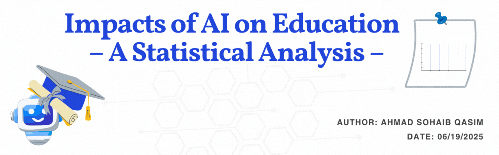
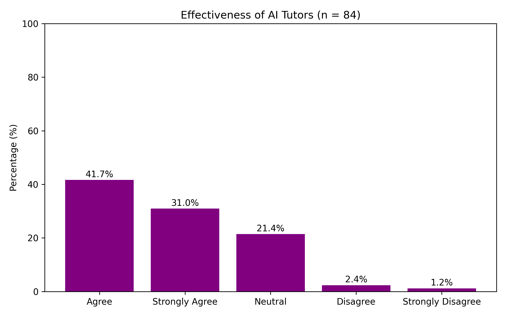
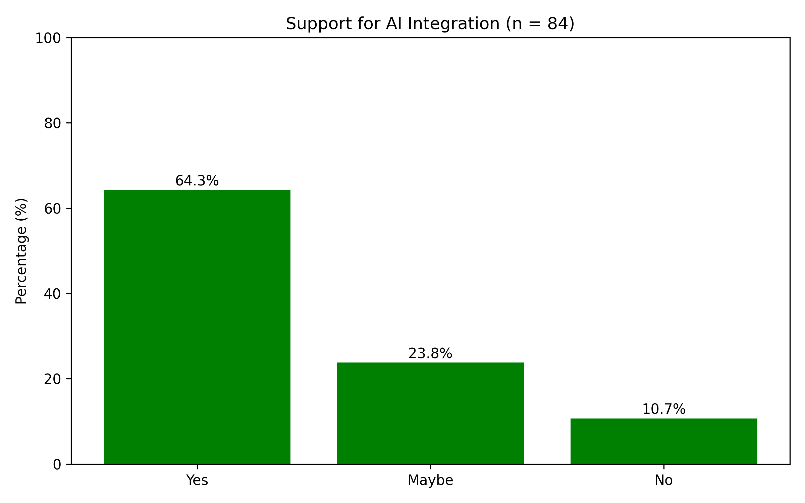
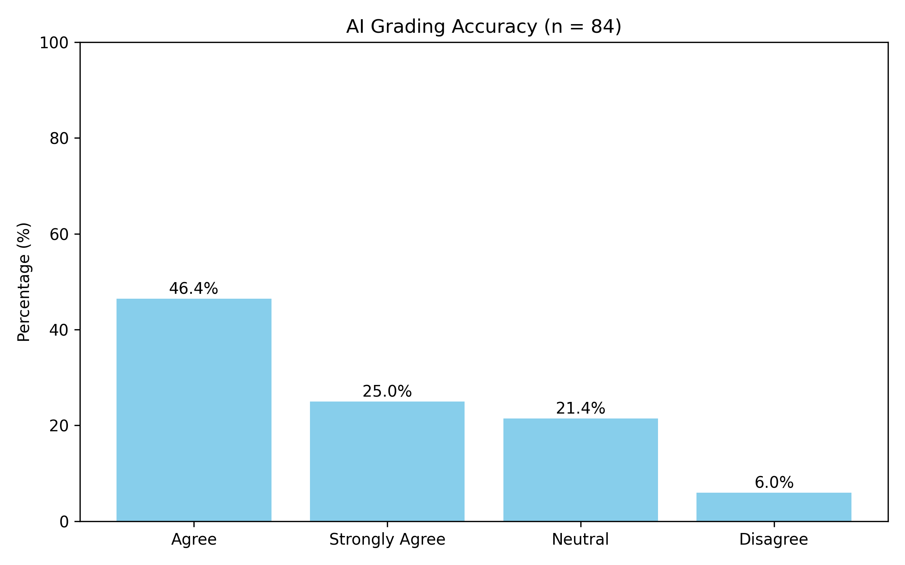
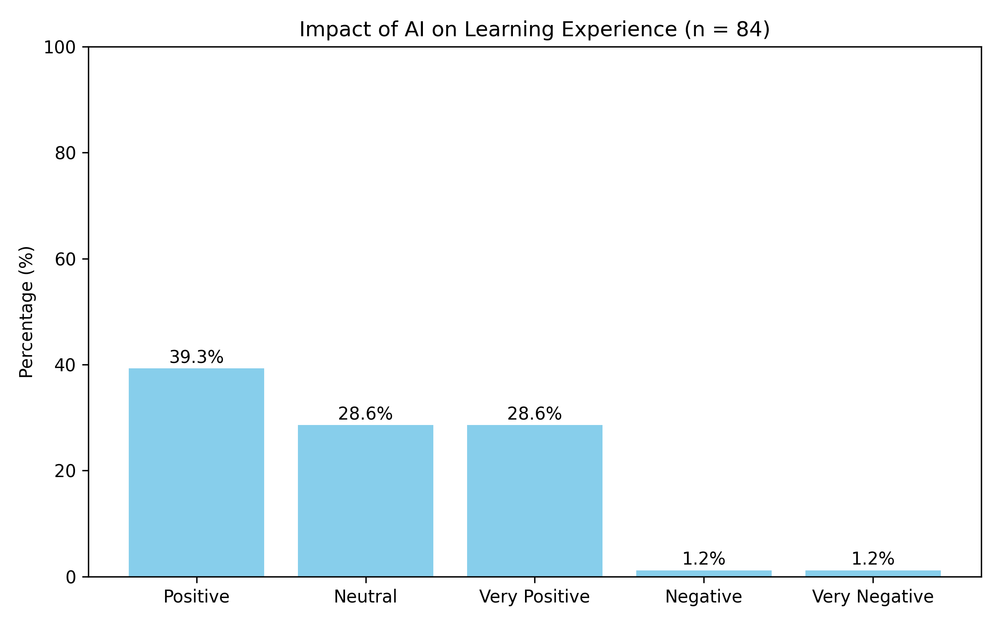
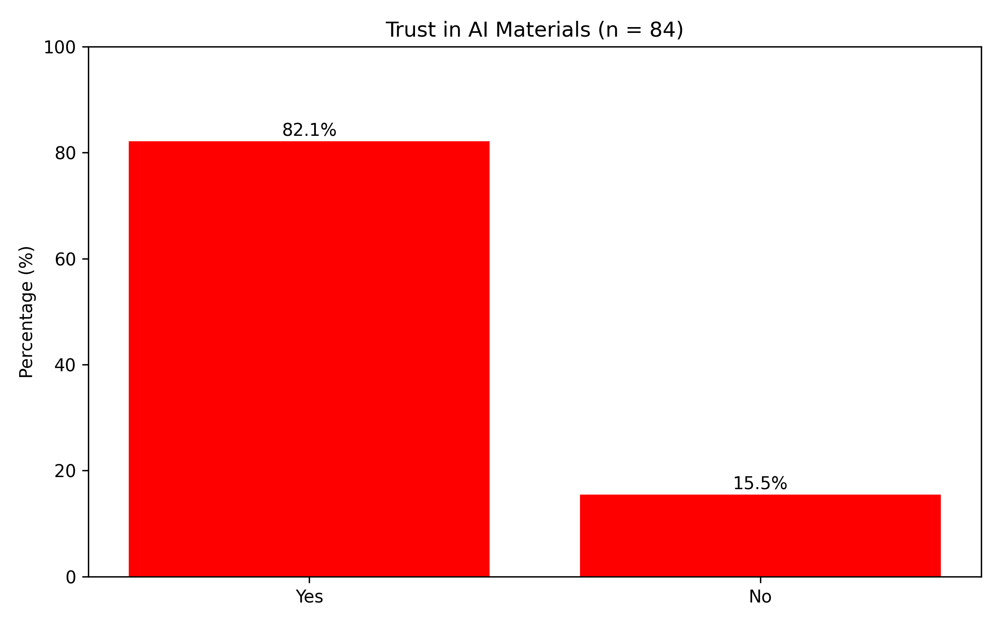
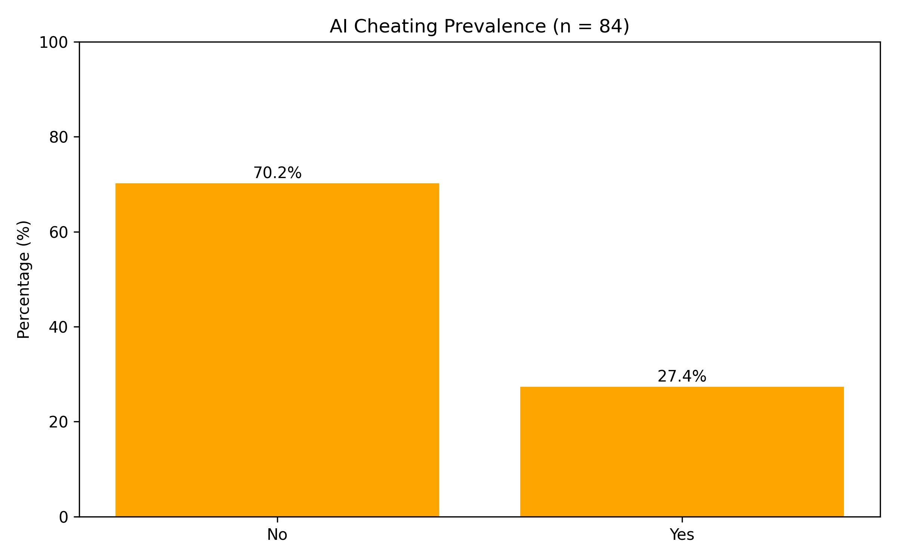
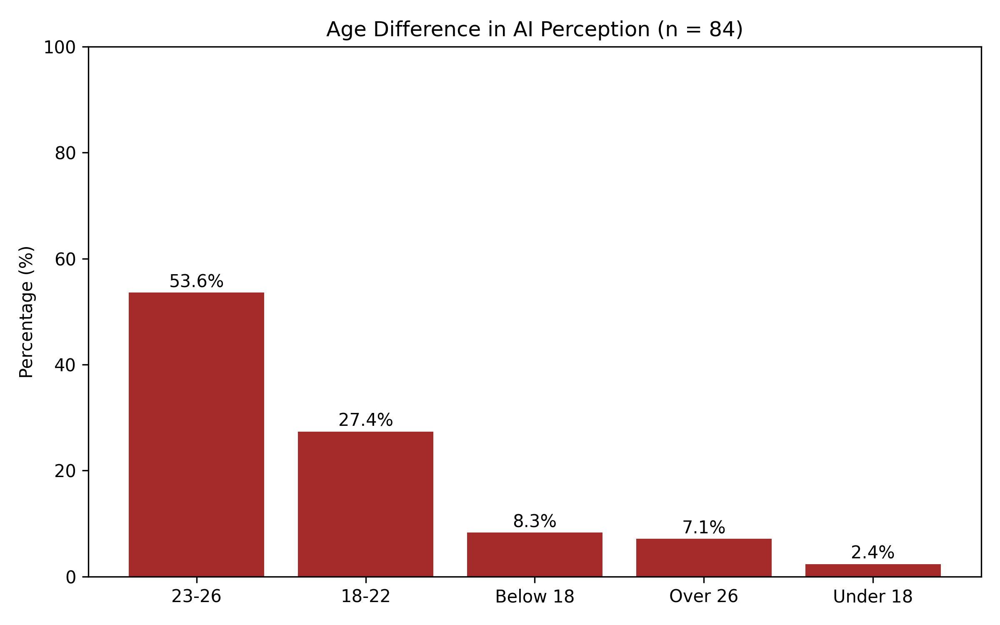
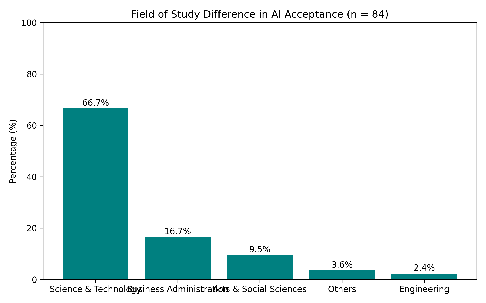

<p align="center">
  
</p>

# AI in Education – Survey-Based Analysis

This project explores how students and teachers from various academic fields perceive the impact of Artificial Intelligence (AI) in education. Based on over **84 survey responses**, the analysis aims to uncover key differences in AI adoption attitudes across disciplines like **Medicine**, **Law**, and **Data Science**.

---

## Technologies Used

- **Python**
- `pandas` – data cleaning & manipulation  
- `numpy` – numerical operations  
- `matplotlib` – data visualization  
- `scipy` – basic statistical analysis  

---

## 📁 Project Structure

```
AI-in-Education-Analysis/
├── analysis_scripts/              
│   ├── effectiveness_ai_tutors.py
│   ├── support_ai_integration.py
│   ├── ai_grading_accuracy.py
│   ├── impact_learning_experience.py
│   ├── trust_ai_materials.py
│   ├── ai_cheating_prevalence.py
│   ├── age_difference_perception.py
│   └── field_study_difference.py
├── graphs/                       
│   ├── effectiveness_ai_tutors.png
│   ├── support_ai_integration.png
│   ├── ai_grading_accuracy.png
│   ├── impact_learning_experience.png
│   ├── trust_ai_materials.png
│   ├── ai_cheating_prevalence.png
│   ├── age_difference_perception.png
│   └── field_study_difference.png
├── responses.csv                   # Survey data file
├── README.md                       # Project documentation
└── .gitignore
```
---

## 📈 Key Insights & Visualizations

### 1. Effectiveness of AI Tutors vs Human Teachers  
<p align="center">
  
</p>

### 2. Support for AI Integration in Teaching  
<p align="center">
  
</p>

### 3. AI Grading Accuracy  
<p align="center">
  
</p>

### 4. Impact of AI on Learning Experience  
<p align="center">
  
</p>

### 5. Trust in AI-Generated Study Materials  
<p align="center">
  
</p>

### 6. AI Cheating Prevalence  
<p align="center">
  
</p>

### 7. Age Difference in AI Effectiveness Perception  
<p align="center">
  
</p>

### 8. Field of Study Difference in AI Acceptance  
<p align="center">
  
</p>


